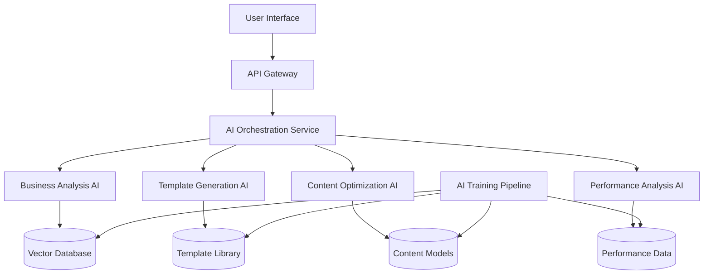

# AI Integration Specifications

## AI System Architecture

### **Core AI Components**

#### **1. Business Analysis AI**
**Purpose**: Analyze business information to generate website recommendations
```
Input: Business type, industry, target audience, goals
Output: Website type recommendation, feature suggestions, content structure
Model: Fine-tuned GPT-4 with custom business analysis prompts
Accuracy Target: 85%+ recommendation accuracy
```

#### **2. Template Generation AI**
**Purpose**: Create initial website templates based on business analysis
```
Input: Business analysis data, design preferences, content requirements
Output: HTML/CSS/JS template, responsive design, basic functionality
Technology: Custom-trained diffusion models + code generation AI
Generation Time: <30 seconds
Customization: Color schemes, layouts, component selection
```

#### **3. Content Optimization AI**
**Purpose**: Generate and optimize website content
```
Input: Business information, target keywords, tone preferences
Output: Headlines, descriptions, calls-to-action, SEO-optimized content
Features: Multi-language support, brand voice adaptation
Real-time: Instant content suggestions during template customization
```

#### **4. Performance Analysis AI**
**Purpose**: Monitor and optimize website performance
```
Input: Website code, user behavior data, performance metrics
Output: Optimization recommendations, issue detection, improvement suggestions
Monitoring: Real-time performance tracking, automated alerts
Automation: Self-healing fixes for common issues
```

## AI Integration Points

### **User-Facing AI Features**

#### **AI Assessment Tool** (`/ai-builder`)
```
Interactive Questionnaire
├── Business Type Detection
├── Industry-Specific Questions
├── Feature Priority Analysis
└── Budget Optimization

Real-time Mockup Generation
├── Instant Template Preview
├── A/B Testing Options
├── Mobile Responsiveness Check
└── Performance Predictions
```

#### **AI Content Assistant**
```
Content Generation
├── Headline Suggestions
├── Description Writing
├── Call-to-Action Creation
└── SEO Optimization

Brand Voice Adaptation
├── Tone Analysis
├── Style Consistency
└── Audience Targeting
```

#### **AI Development Assistant**
```
Code Optimization
├── Performance Improvements
├── Accessibility Enhancements
├── SEO Best Practices
└── Security Hardening

Smart Suggestions
├── Feature Recommendations
├── Integration Options
└── Scalability Planning
```

### **Backend AI Services**

#### **AI Template Engine**
```
Template Library: 500+ pre-built templates
Customization Engine: AI-powered modifications
Quality Assurance: Automated testing and validation
Version Control: AI-suggested improvements over time
```

#### **AI Quality Assurance**
```
Automated Testing
├── Visual Regression Testing
├── Performance Benchmarking
├── Accessibility Auditing
└── SEO Validation

Issue Detection
├── Code Quality Analysis
├── Security Vulnerability Scanning
└── Performance Bottleneck Identification
```

#### **AI Customer Support**
```
Intelligent Ticketing
├── Issue Classification
├── Priority Assessment
├── Solution Suggestions
└── Automated Responses

Predictive Support
├── Issue Prevention
├── Maintenance Scheduling
└── Upgrade Recommendations
```

## Technical Implementation

### **AI Service Architecture**



### **AI Model Specifications**

#### **Primary AI Models**
- **OpenAI GPT-4**: Content generation, business analysis
- **Custom Fine-tuned Models**: Industry-specific recommendations
- **Computer Vision Models**: Template analysis and optimization
- **NLP Models**: Content optimization and SEO

#### **Performance Requirements**
- **Response Time**: <2 seconds for assessments
- **Accuracy**: >90% for template recommendations
- **Availability**: 99.9% uptime
- **Scalability**: Handle 1000+ concurrent users

### **Data Management**

#### **Training Data**
```
Business Profiles: 10,000+ anonymized business analyses
Website Templates: 500+ categorized templates
Performance Data: Real-time metrics from live sites
User Feedback: Ratings and improvement suggestions
```

#### **Data Privacy**
```
GDPR Compliance: Data anonymization and consent management
Data Retention: 2-year maximum for training data
User Control: Opt-out options for AI learning
Security: Encrypted data storage and transmission
```

## AI User Experience

### **Progressive AI Enhancement**
```
Level 1: Basic AI suggestions (free)
Level 2: Advanced AI customization (paid)
Level 3: Full AI automation (enterprise)
```

### **AI Transparency**
```
Explainability: Show how AI made recommendations
User Control: Override AI suggestions
Feedback Loop: Rate AI suggestions for improvement
Human Oversight: Expert review of AI-generated content
```

### **AI Learning & Improvement**
```
Continuous Learning
├── User feedback integration
├── Performance metric analysis
└── A/B testing results

Model Updates
├── Weekly model retraining
├── Feature additions based on usage
└── Accuracy improvements
```

## Integration Roadmap

### **Phase 1: Foundation (Months 1-2)**
- Implement basic AI assessment tool
- Integrate content generation AI
- Set up AI model infrastructure

### **Phase 2: Enhancement (Months 3-4)**
- Advanced template generation
- Performance analysis AI
- Real-time AI suggestions

### **Phase 3: Optimization (Months 5-6)**
- Predictive AI features
- Automated quality assurance
- AI-powered customer support

### **Phase 4: Innovation (Months 7-12)**
- Custom AI model training
- Advanced automation features
- AI-driven business insights

## Success Metrics

### **AI Performance Metrics**
- **User Satisfaction**: 4.5+ star rating for AI features
- **Conversion Rate**: 25%+ increase in quote generation
- **Time Savings**: 60%+ reduction in initial consultation time
- **Accuracy Rate**: 90%+ for AI recommendations

### **Technical Metrics**
- **Response Time**: <1.5 seconds average
- **Error Rate**: <0.1% for AI-generated content
- **Uptime**: 99.95% for AI services
- **Cost Efficiency**: 40%+ reduction in development time

This AI integration transforms Sitemendr from a traditional web development agency into a cutting-edge, AI-powered platform that delivers faster, smarter, and more personalized web solutions.