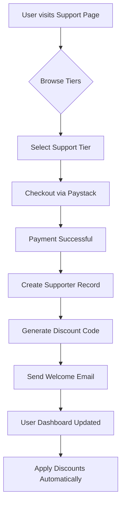
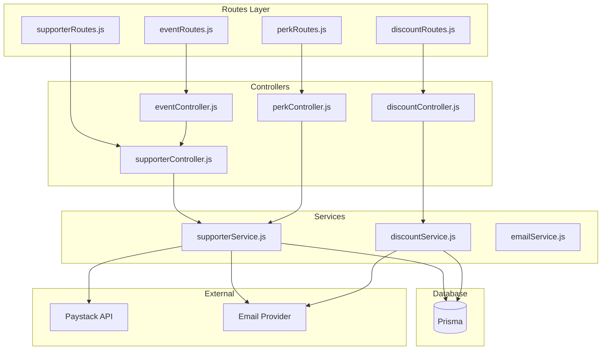
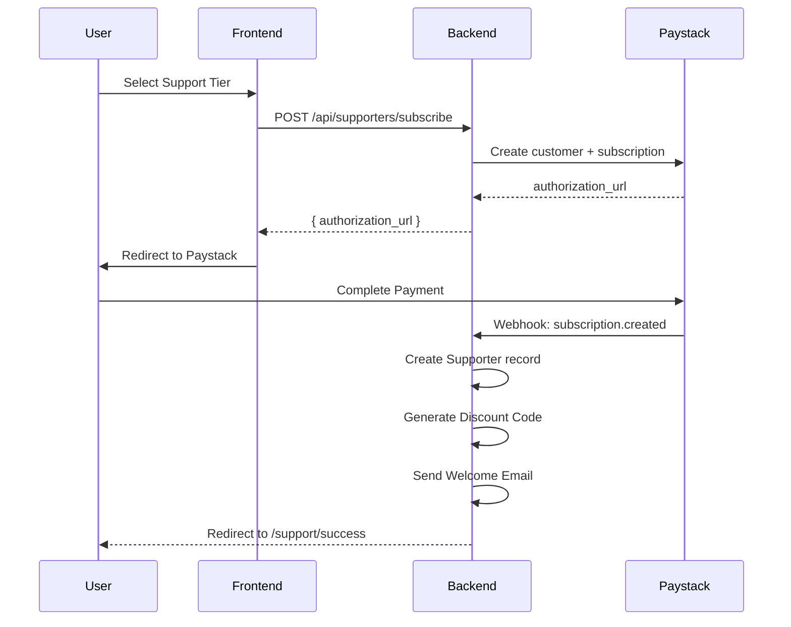
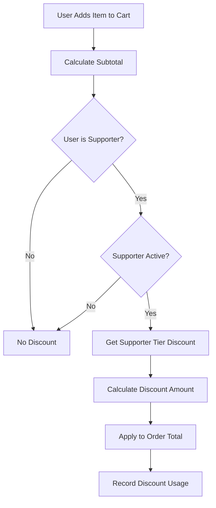

# Supporter Rewards System - Architecture Plan

## Overview

This document outlines the detailed architecture for implementing a **Supporter Rewards System** for Sitemendr. The system allows users to become supporters with tier-based benefits, discount codes, and exclusive perks. This integrates with the existing payment infrastructure (Paystack) and user management system.

---

## Table of Contents

1. [System Overview](#system-overview)
2. [Database Schema](#database-schema)
3. [Backend Architecture](#backend-architecture)
4. [Frontend Architecture](#frontend-architecture)
5. [Payment Integration](#payment-integration)
6. [Discount System](#discount-system)
7. [Email Notifications](#email-notifications)
8. [API Endpoints](#api-endpoints)
9. [Security Considerations](#security-considerations)
10. [Implementation Roadmap](#implementation-roadmap)

---

## System Overview

The Supporter Rewards System enables users to financially support the platform in exchange for tiered benefits. Key features include:

- **5-Tier Support System**: From Starter Supporter ($5/month) to Founders Circle ($100/month)
- **Automatic Discounts**: Tier-based percentage discounts on all purchases
- **Perk Management**: Track and deliver digital perks (badges, early access, AMAs)
- **Community Features**: Supporter wall, product council voting, roundtable invites
- **Payment Integration**: Reuses existing Paystack subscription infrastructure

### Core User Flow



---

## Database Schema

### New Prisma Models

Add the following models to [`backend/prisma/schema.prisma`](backend/prisma/schema.prisma):

```prisma
// =============================================================================
// Supporter Models
// =============================================================================

/// Supporter tier configuration (managed by admin)
model SupporterTier {
  id                String          @id @default(uuid())
  name              String          // e.g., "Starter Supporter", "Founders Circle"
  slug              String          @unique // e.g., "starter", "founders-circle"
  description       String?
  monthlyPrice      Float           // Monthly subscription price in USD
  yearlyPrice       Float?          // Optional yearly price
  discountPercent   Int             // Discount percentage: 5, 10, 15, 20, 25
  displayOrder      Int             @default(0)
  isActive          Boolean         @default(true)
  
  // Perks (JSON array of perk IDs)
  perks             String[]        // e.g., ["badge", "wall", "early-access"]
  
  // Relations
  supporters        Supporter[]
  discountCodes     DiscountCode[]
  
  createdAt         DateTime        @default(now())
  updatedAt         DateTime        @updatedAt
}

/// Individual supporter subscription
model Supporter {
  id                String          @id @default(uuid())
  userId            String
  user              User            @relation(fields: [userId], references: [id])
  tierId            String
  tier              SupporterTier   @relation(fields: [tierId], references: [id])
  
  // Subscription details
  status            SupporterStatus @default(active)
  reference         String          @unique // Paystack subscription reference
  
  // Billing
  monthlyAmount     Float
  currency          String          @default("USD")
  currentPeriodStart DateTime?
  currentPeriodEnd   DateTime?
  lastPaymentDate   DateTime?
  cancelAtPeriodEnd Boolean         @default(false)
  
  // Profile visibility
  showOnWall        Boolean         @default(true)
  spotlightTier     Int             @default(0) // 0=none, 1-5=tier level
  
  // Relations
  discountCodes     DiscountCode[]
  redeemedPerks     RedeemedPerk[]
  payments          Payment[]
  
  createdAt         DateTime        @default(now())
  updatedAt         DateTime        @updatedAt
}

enum SupporterStatus {
  active
  paused
  cancelled
  expired
}

/// Discount codes generated for supporters
model DiscountCode {
  id                String          @id @default(uuid())
  code              String          @unique // e.g., "SUPPORTER-2024-XYZ123"
  
  // Ownership
  supporterId       String?
  supporter         Supporter?      @relation(fields: [supporterId], references: [id])
  tierId            String?
  tier              SupporterTier?  @relation(fields: [tierId], references: [id])
  
  // Discount details
  discountType      DiscountType    @default(percentage)
  discountValue     Float           // e.g., 10 for 10%
  minPurchaseAmount Float?          // Minimum order amount to qualify
  maxUses           Int?             // Maximum uses (null = unlimited)
  currentUses       Int             @default(0)
  
  // Validity
  isActive          Boolean         @default(true)
  validFrom         DateTime        @default(now())
  expiresAt         DateTime?
  
  // Relations
  orders            Order[]
  
  createdAt         DateTime        @default(now())
  updatedAt         DateTime        @updatedAt
}

enum DiscountType {
  percentage
  fixed
}

/// Perks that supporters can redeem
model Perk {
  id                String          @id @default(uuid())
  name              String
  slug              String          @unique
  description       String?
  icon              String?         // Icon name (e.g., "badge", "video")
  tierRequired      String[]        // Required tier slugs
  
  // Redemption
  isRedeemable      Boolean         @default(true)
  maxRedemptions    Int?            // Per supporter limit
  
  // Content
  redemptionUrl     String?         // Link to content (video, download, etc.)
  redemptionCode    String?         // Secret code for manual redemption
  
  // Relations
  redeemedPerks     RedeemedPerk[]
  
  createdAt         DateTime        @default(now())
  updatedAt         DateTime        @updatedAt
}

/// Track which perks a supporter has redeemed
model RedeemedPerk {
  id                String          @id @default(uuid())
  supporterId       String
  supporter         Supporter       @relation(fields: [supporterId], references: [id])
  perkId            String
  perk              Perk            @relation(fields: [perkId], references: [id])
  
  redeemedAt        DateTime        @default(now())
  redemptionCode    String?         // For manual redemption
  
  @@unique([supporterId, perkId])
}

/// Supporter spotlight entries (public wall)
model SupporterSpotlight {
  id                String          @id @default(uuid())
  supporterId       String
  supporter         Supporter       @relation(fields: [supporterId], references: [id])
  
  message           String?         // Optional personal message
  displayName       String?         // Custom display name
  tierLevel         Int             // Snapshot of tier level
  
  isActive          Boolean         @default(true)
  displayOrder      Int             @default(0)
  
  createdAt         DateTime        @default(now())
}

/// Community events (roundtables, AMAs)
model CommunityEvent {
  id                String          @id @default(uuid())
  title              String
  slug              String          @unique
  description       String
  eventType         EventType       // roundtable, ama, poll
  
  // Scheduling
  scheduledAt       DateTime
  durationMinutes   Int             @default(60)
  timezone          String          @default("UTC")
  
  // Access
  tierRequired      String[]        // Required tier slugs
  maxParticipants   Int?
  currentParticipants Int           @default(0)
  
  // Content
  meetingLink       String?         // Zoom/Google Meet link
  recordingUrl      String?         // Post-event recording
  
  // Status
  status            EventStatus     @default(scheduled)
  
  createdAt         DateTime        @default(now())
  updatedAt         DateTime        @updatedAt
}

enum EventType {
  roundtable
  ama
  poll
}

enum EventStatus {
  scheduled
  live
  completed
  cancelled
}

/// Event registrations
model EventRegistration {
  id                String          @id @default(uuid())
  eventId           String
  event             CommunityEvent  @relation(fields: [eventId], references: [id])
  supporterId       String
  supporter         Supporter       @relation(fields: [supporterId], references: [id])
  
  status            String          @default("registered") // registered, attended, no-show
  
  registeredAt      DateTime        @default(now())
  
  @@unique([eventId, supporterId])
}

/// Product council voting
model ProductVote {
  id                String          @id @default(uuid())
  title             String
  description       String
  options           String[]        // Voting options as JSON
  
  // Access
  tierRequired      String[]        // Required tier slugs
  
  // Timing
  startsAt          DateTime
  endsAt            DateTime
  
  // Status
  status            VoteStatus      @default(draft)
  
  // Relations
  votes             VoteChoice[]
  
  createdAt         DateTime        @default(now())
  updatedAt         DateTime        @updatedAt
}

enum VoteStatus {
  draft
  active
  closed
  results
}

/// Individual vote choices
model VoteChoice {
  id                String          @id @default(uuid())
  voteId            String
  vote              ProductVote     @relation(fields: [voteId], references: [id])
  supporterId       String
  supporter         Supporter       @relation(fields: [supporterId], references: [id])
  
  optionIndex       Int             // Which option was chosen
  
  votedAt           DateTime        @default(now())
  
  @@unique([voteId, supporterId])
}
```

### Schema Extension for Existing User Model

Add supporter relation to existing User model:

```prisma
model User {
  // ... existing fields ...
  
  // New relations
  supporters        Supporter[]
}
```

---

## Backend Architecture

### Module Structure



### Controller Responsibilities

#### [`backend/controllers/supporterController.js`](backend/controllers/supporterController.js)

| Method | Endpoint | Description |
|--------|----------|-------------|
| `getTiers` | `GET /api/supporters/tiers` | List all active supporter tiers |
| `createSubscription` | `POST /api/supporters/subscribe` | Initialize Paystack subscription |
| `handleWebhook` | `POST /api/supporters/webhook` | Process Paystack subscription events |
| `getMySupporter` | `GET /api/supporters/me` | Get current user's supporter status |
| `updatePreferences` | `PUT /api/supporters/me/preferences` | Update showOnWall, spotlight |
| `cancelSubscription` | `POST /api/supporters/me/cancel` | Cancel at period end |
| `getStats` | `GET /api/supporters/admin/stats` | Admin: supporter statistics |

#### [`backend/controllers/discountController.js`](backend/controllers/discountController.js)

| Method | Endpoint | Description |
|--------|----------|-------------|
| `getMyCodes` | `GET /api/discounts/my-codes` | List user's discount codes |
| `generateCode` | `POST /api/discounts/generate` | Generate new code for supporter |
| `validateCode` | `POST /api/discounts/validate` | Validate code before checkout |
| `applyDiscount` | `POST /api/discounts/apply` | Apply discount to order |
| `getCodeUsage` | `GET /api/discounts/:code/usage` | Admin: code usage stats |

#### [`backend/controllers/perkController.js`](backend/controllers/perkController.js)

| Method | Endpoint | Description |
|--------|----------|-------------|
| `getAvailablePerks` | `GET /api/perks` | List all available perks |
| `getMyPerks` | `GET /api/perks/my-perks` | List perks available to current supporter |
| `redeemPerk` | `POST /api/perks/:id/redeem` | Redeem a specific perk |

#### [`backend/controllers/eventController.js`](backend/controllers/eventController.js)

| Method | Endpoint | Description |
|--------|----------|-------------|
| `getEvents` | `GET /api/events` | List upcoming community events |
| `getEvent` | `GET /api/events/:slug` | Get event details |
| `register` | `POST /api/events/:id/register` | Register for event |
| `getVotes` | `GET /api/votes` | List active votes |
| `castVote` | `POST /api/votes/:id/vote` | Cast a vote |

### Service Layer

#### [`backend/services/supporterService.js`](backend/services/supporterService.js)

Key functions:

```javascript
// Create a new supporter subscription
async function createSupporterSubscription(userId, tierId, paymentData) {
  // 1. Validate tier exists and is active
  // 2. Create Paystack customer if needed
  // 3. Initialize Paystack subscription
  // 4. Create Supporter record in database
  // 5. Generate initial discount code
  // 6. Send welcome email
}

// Handle subscription events from Paystack
async function handleSubscriptionEvent(event) {
  // Handle: subscription.created, subscription.not_renew, 
  // subscription.expired, charge.success, charge.failed
}

// Apply supporter discount to any purchase
async function getSupporterDiscount(userId, baseAmount) {
  // 1. Check if user has active supporter status
  // 2. Get their tier's discount percentage
  // 3. Calculate discounted price
}
```

#### [`backend/services/discountService.js`](backend/services/discountService.js)

Key functions:

```javascript
// Generate unique discount code
function generateDiscountCode(supporterId, tierSlug) {
  // Format: SUPPORTER-{TIER}-{RANDOM}
  // e.g., SUPPORTER-BUILDER-ABC123
}

// Validate discount code
async function validateDiscountCode(code, orderAmount) {
  // 1. Check code exists and is active
  // 2. Check not expired
  // 3. Check min purchase requirement
  // 4. Check max uses not exceeded
  // 5. Return calculated discount
}

// Apply discount to order
async function applyDiscountToOrder(codeId, orderId) {
  // 1. Increment currentUses
  // 2. Link order to discount code
}
```

---

## Frontend Architecture

### New Pages Required

| Page | Route | Description |
|------|-------|-------------|
| Support Home | `/support` | Main supporter tiers display |
| Support Checkout | `/support/checkout/[tier]` | Checkout flow for selected tier |
| Supporter Dashboard | `/dashboard/supporter` | View perks, codes, history |
| Community Events | `/support/events` | View upcoming events |
| Product Council | `/support/votes` | Active votes and polls |

### Component Structure

```
frontend/src/
├── app/
│   ├── support/
│   │   ├── page.tsx              # Main support tiers page
│   │   ├── checkout/
│   │   │   └── [tier]/
│   │   │       └── page.tsx      # Tier checkout page
│   │   └── events/
│   │       └── page.tsx          # Community events
│   └── dashboard/
│       └── supporter/
│           └── page.tsx          # Supporter dashboard
├── components/
│   └── supporter/
│       ├── TierCard.tsx          # Individual tier display
│       ├── TierComparison.tsx     # Side-by-side comparison
│       ├── PerkCard.tsx           # Available perk display
│       ├── DiscountCodeCard.tsx  # User's discount codes
│       ├── SupporterBadge.tsx     # Profile badge component
│       ├── EventCard.tsx         # Community event card
│       └── VoteCard.tsx          # Product vote card
└── lib/
    └── api.ts                    # Add supporter API methods
```

### Key Frontend Components

#### TierCard Component

Displays individual supporter tier with:
- Tier name and description
- Monthly/yearly pricing
- List of perks included
- "Become a Supporter" CTA button

```typescript
// frontend/src/components/supporter/TierCard.tsx
interface TierCardProps {
  tier: SupporterTier;
  isPopular?: boolean;
  onSelect: (tier: SupporterTier) => void;
  isLoading?: boolean;
}
```

#### SupporterBadge Component

Shows supporter status on user profiles:
- Badge icon based on tier
- Tooltip showing tier name
- Optional: clickable to view supporter profile

```typescript
// frontend/src/components/supporter/SupporterBadge.tsx
interface SupporterBadgeProps {
  tierSlug: string;
  size?: 'sm' | 'md' | 'lg';
  showLabel?: boolean;
}
```

#### DiscountCodeCard Component

Displays user's discount codes:
- Code value (e.g., "15% off")
- Copy-to-clipboard functionality
- Usage stats (uses remaining)
- Validity period

---

## Payment Integration

### Integration with Existing Paystack System

The supporter system reuses existing payment infrastructure:



### Service Type for Payments

When initializing payment for supporter subscription:

```javascript
const paymentData = {
  amount: tier.monthlyPrice,
  serviceType: 'supporter',  // NEW: identifies as supporter payment
  description: `Supporter subscription - ${tier.name}`,
  metadata: {
    supporterTierId: tier.id,
    billingCycle: 'monthly' // or 'yearly'
  }
};
```

### Webhook Handling

Extend [`backend/controllers/paymentController.js`](backend/controllers/paymentController.js) webhook handler:

```javascript
// In handleWebhook function, add:
if (serviceType === 'supporter') {
  await processSupporterPayment(payment);
}
```

---

## Discount System

### Automatic Discount Application

Discounts are applied automatically when supporters make purchases:



### Discount Code Generation

Each supporter receives a unique discount code:

| Tier | Code Format | Example |
|------|-------------|---------|
| Starter | `SUPPORTER-STARTER-XXXXX` | `SUPPORTER-STARTER-ABC123` |
| Growth | `SUPPORTER-GROWTH-XXXXX` | `SUPPORTER-GROWTH-DEF456` |
| Builder | `SUPPORTER-BUILDER-XXXXX` | `SUPPORTER-BUILDER-GHI789` |
| Champion | `SUPPORTER-CHAMPION-XXXXX` | `SUPPORTER-CHAMPION-JKL012` |
| Founders | `SUPPORTER-FOUNDER-XXXXX` | `SUPPORTER-FOUNDER-MNO345` |

### Discount Stacking Rules

- **Automatic discount** (from tier) always applies
- **Discount codes** can be entered manually at checkout
- Supporter discount + manual code = **higher of two** (not cumulative)
- Promotional codes from admin = can stack with supporter discount

---

## Email Notifications

### Email Templates

Using existing [`backend/config/email.js`](backend/config/email.js):

| Template | Trigger | Recipient |
|----------|---------|-----------|
| Supporter Welcome | New supporter signup | Supporter |
| Supporter Confirmation | Payment confirmed | Supporter |
| Tier Upgrade | Supporter upgrades tier | Supporter |
| Perk Available | New perk unlocked | Supporter |
| Event Invitation | Community event scheduled | Eligible supporters |
| Vote Started | New product vote | Eligible supporters |
| Subscription Expiring | 7 days before renewal | Supporter |
| Subscription Cancelled | Cancellation confirmed | Supporter |

### Sample Welcome Email

```html
<div style="font-family: sans-serif; max-width: 600px; margin: 0 auto;">
  <h1>Welcome to the Sitemendr Family! 🎉</h1>
  
  <p>Thank you for becoming a <strong>[TIER NAME] Supporter</strong>!</p>
  
  <div style="background: #f5f5f5; padding: 20px; border-radius: 8px; margin: 20px 0;">
    <h3>Your Supporter Perks</h3>
    <ul>
      <li>[PERK 1]</li>
      <li>[PERK 2]</li>
      <li>[PERK 3]</li>
    </ul>
  </div>
  
  <div style="background: #0066FF; color: white; padding: 20px; border-radius: 8px; margin: 20px 0;">
    <h3>Your Discount Code</h3>
    <p style="font-size: 24px; font-weight: bold;">[DISCOUNT CODE]</p>
    <p>Use this code for [X]% off all purchases!</p>
  </div>
  
  <a href="[DASHBOARD_URL]" style="btn">View Your Perks</a>
</div>
```

---

## API Endpoints

### Complete API Specification

#### Supporter Endpoints

| Method | Endpoint | Auth | Description |
|--------|----------|------|-------------|
| `GET` | `/api/supporters/tiers` | Public | List all supporter tiers |
| `GET` | `/api/supporters/tiers/:id` | Public | Get single tier details |
| `POST` | `/api/supporters/subscribe` | Required | Create new subscription |
| `GET` | `/api/supporters/webhook` | Public (Paystack) | Webhook handler |
| `GET` | `/api/supporters/me` | Required | Get current supporter status |
| `PUT` | `/api/supporters/me/preferences` | Required | Update preferences |
| `POST` | `/api/supporters/me/cancel` | Required | Cancel subscription |
| `GET` | `/api/supporters/admin/stats` | Admin | Get statistics |

#### Discount Endpoints

| Method | Endpoint | Auth | Description |
|--------|----------|------|-------------|
| `GET` | `/api/discounts/my-codes` | Required | List user's codes |
| `POST` | `/api/discounts/validate` | Optional | Validate code |
| `POST` | `/api/discounts/apply` | Required | Apply to order |
| `GET` | `/api/discounts/:code/usage` | Admin | Code usage stats |

#### Perk Endpoints

| Method | Endpoint | Auth | Description |
|--------|----------|------|-------------|
| `GET` | `/api/perks` | Public | List all perks |
| `GET` | `/api/perks/my-perks` | Required | Available perks |
| `POST` | `/api/perks/:id/redeem` | Required | Redeem perk |

#### Event Endpoints

| Method | Endpoint | Auth | Description |
|--------|----------|------|-------------|
| `GET` | `/api/events` | Public | List upcoming events |
| `GET` | `/api/events/:slug` | Public | Event details |
| `POST` | `/api/events/:id/register` | Required | Register |
| `DELETE` | `/api/events/:id/register` | Required | Unregister |

#### Vote Endpoints

| Method | Endpoint | Auth | Description |
|--------|----------|------|-------------|
| `GET` | `/api/votes` | Public | Active votes |
| `GET` | `/api/votes/:id` | Public | Vote details |
| `POST` | `/api/votes/:id/vote` | Required | Cast vote |

---

## Security Considerations

### Authentication & Authorization

1. **Supporter endpoints** require authentication (`authenticate` middleware)
2. **Admin endpoints** require admin role (`requireAdmin` middleware)
3. **Webhook endpoint** verified via Paystack signature
4. **Discount code validation** rate-limited to prevent brute force

### Data Protection

1. **PII handling**: Supporter emails stored encrypted at rest
2. **Payment data**: Never stored - all via Paystack
3. **Discount codes**: Generated using crypto-random values

### Fraud Prevention

1. **Discount code usage**: Tracked per user to prevent abuse
2. **Subscription limits**: One active subscription per user
3. **Rate limiting**: Applied to API endpoints
4. **Input validation**: All inputs validated via middleware

---

## Implementation Roadmap

### Phase 1: Core Infrastructure (Week 1)

- [ ] Add database models to Prisma schema
- [ ] Run database migration
- [ ] Create supporter controller and routes
- [ ] Create discount controller and routes
- [ ] Create supporter service layer
- [ ] Create discount service layer
- [ ] Add webhook handling for Paystack

### Phase 2: Frontend Core (Week 2)

- [ ] Add supporter API methods to frontend
- [ ] Create Support page (`/support`)
- [ ] Create TierCard component
- [ ] Create checkout flow
- [ ] Add supporter badge to profile

### Phase 3: Discount System (Week 2-3)

- [ ] Integrate discount validation into payment flow
- [ ] Create discount code display in dashboard
- [ ] Add copy-to-clipboard functionality

### Phase 4: Perks & Events (Week 3)

- [ ] Create perk controller and routes
- [ ] Create event controller and routes
- [ ] Create PerkCard component
- [ ] Create EventCard component
- [ ] Build events page

### Phase 5: Community Features (Week 4)

- [ ] Create vote/polling system
- [ ] Build supporter spotlight wall
- [ ] Add product council features

### Phase 6: Polish & Testing (Week 4-5)

- [ ] Email template customization
- [ ] Admin dashboard for supporter management
- [ ] Comprehensive testing
- [ ] Documentation

---

## Summary

This architecture provides a complete supporter rewards system that:

1. **Integrates seamlessly** with existing payment and user systems
2. **Scales horizontally** with tiered benefits
3. **Engages community** through events and voting
4. **Rewards loyalty** with automatic discounts
5. **Maintains security** through established patterns

The system can be implemented incrementally using the phased approach outlined above.

---

*Document Version: 1.0*  
*Last Updated: 2026-03-10*  
*For: Sitemendr Supporter Rewards System*
