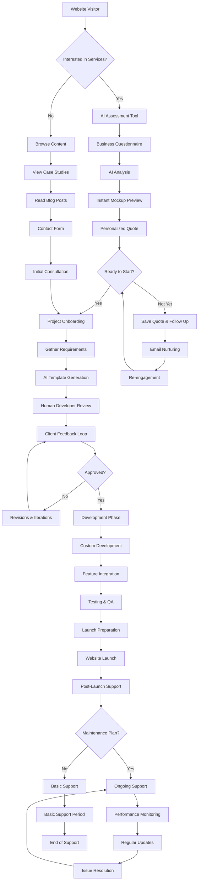

# Sitemendr User Flow Diagram

## Key Flow Highlights

### **Discovery Phase**
- **AI Assessment Tool**: Interactive questionnaire that generates instant website mockups
- **Personalized Quotes**: Dynamic pricing based on business needs
- **Content Marketing**: Case studies and blog posts to build trust

### **Development Phase**
- **AI Template Generation**: Automated initial design creation
- **Human Refinement**: Expert developers enhance AI-generated templates
- **Iterative Feedback**: Client approval loops ensure satisfaction

### **Launch & Support Phase**
- **Comprehensive Launch**: Full deployment with training
- **Flexible Maintenance**: Optional ongoing support plans
- **Performance Monitoring**: Continuous optimization

## User Experience Principles

### **Frictionless Onboarding**
- AI-powered assessment reduces time to quote
- Clear next steps at each stage
- Multiple entry points (assessment, contact, content)

### **Transparent Process**
- Visual progress tracking
- Regular communication touchpoints
- Clear deliverables and timelines

### **Value-Driven Experience**
- Instant value through AI mockups
- Educational content throughout journey
- Results-focused messaging

## Technical Implementation

### **Progressive Disclosure**
- Start with simple assessment
- Gradually introduce complexity
- Context-aware next steps

### **AI Integration Points**
- Initial business analysis
- Template generation
- Content suggestions
- Performance optimization

### **Human Touch Points**
- Expert consultation calls
- Personal project managers
- Dedicated support channels

This flow transforms the traditional web development process into an AI-enhanced, human-guided experience that delivers faster results with higher satisfaction.